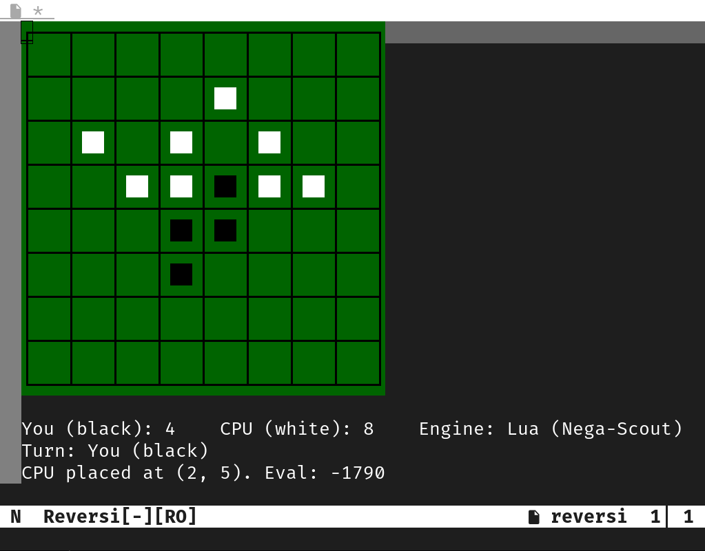

# reversi.vim

- Play Reversi in Vim/Neovim without any external dependencies.
- Features a CPU opponent that uses a simple position-based evaluation.
- **If Lua support is available (Neovim or Vim with `+lua`), a much stronger engine using the Nega-Scout algorithm will be used.**



## Installation
### Using [vim-plug](https://github.com/junegunn/vim-plug)

```vim
Plug 'tokinasin/reversi.vim'
```

## Usage

Start a new game:

```vim
:Reversi
```

  - The first player is chosen randomly.
  - Move the cursor to an empty square.
  - Press `<CR>` (Enter) to place your disc.
  - The CPU will automatically respond.

## Documentation

```vim
:help reversi
```

## TODO
- make CPU stronger

## Acknowledgements

The board evaluation weights used in the AI engine are based on the values provided in the following article. A big thank you to the author.

  - [オセロAIの作り方(1) ～盤面評価とミニマックス法～](https://note.com/nyanyan_cubetech/n/n17c169271832)

## License

You can use this work under the terms of either:

  - [CC0-1.0 Universal](https://www.google.com/search?q=LICENSE-CC0.txt)
  - [The Unlicense](https://www.google.com/search?q=LICENSE-UNLICENSE.txt)
